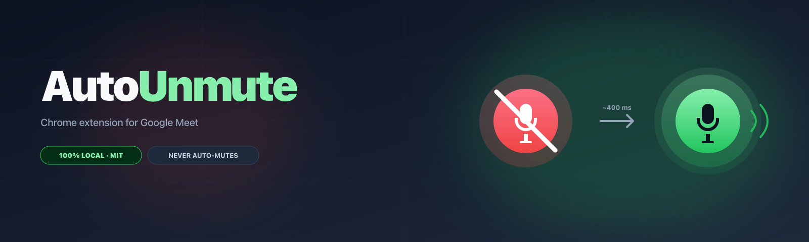
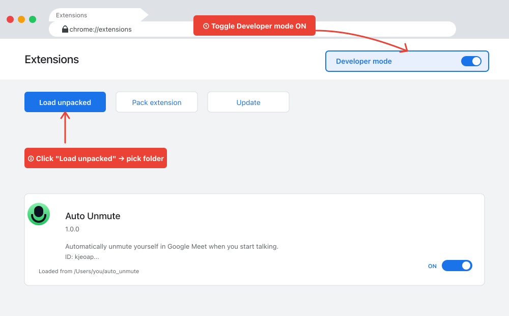
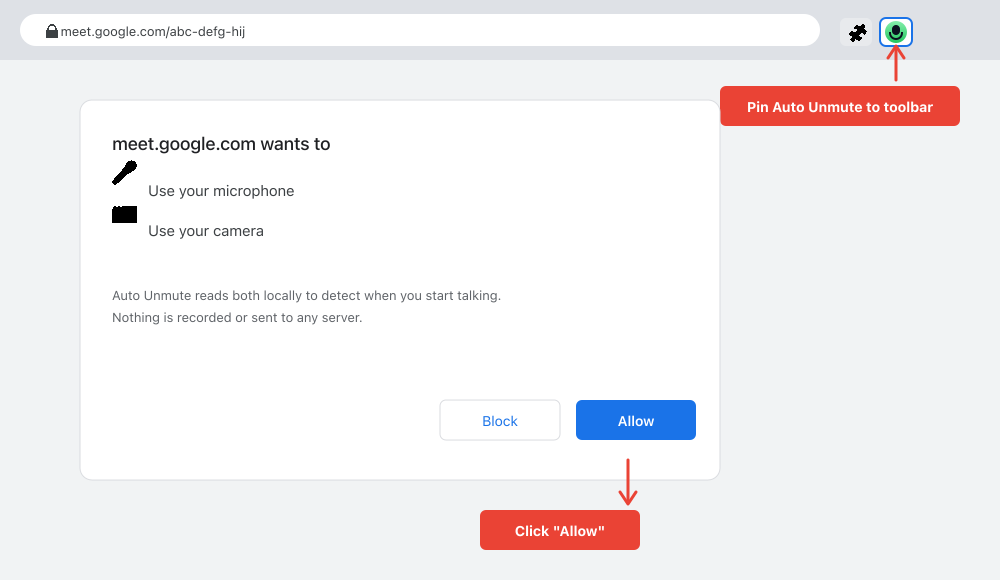
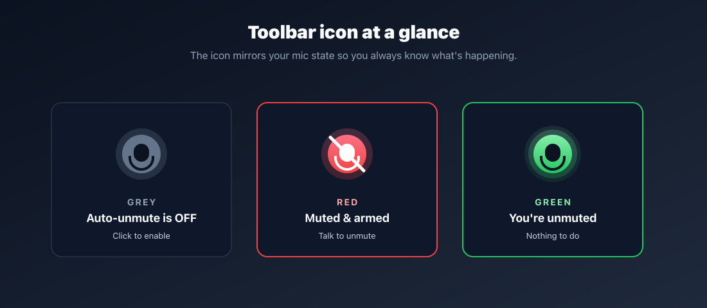
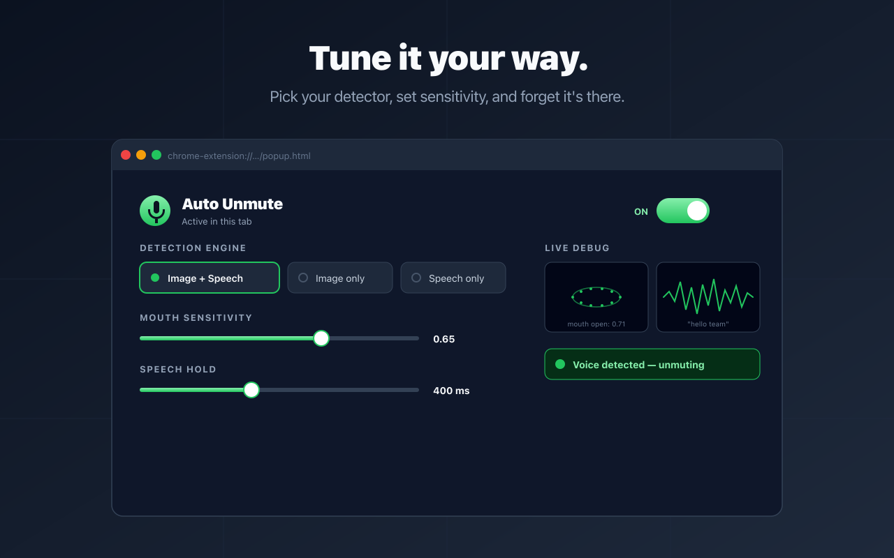

<div align="center">
  
</div>

# Auto Unmute

A Chrome extension that **automatically unmutes you in [Google Meet](https://meet.google.com/) when you start talking while muted** — using mouth-movement detection ([face-api.js](https://github.com/justadudewhohacks/face-api.js)) and the Web Speech API.

It is the inverse of [`morphoinc/auto_mute`](https://github.com/morphoinc/auto_mute): instead of muting you when you go quiet, it unmutes you when you forget you were muted and start talking. **It never re-mutes you.**

* [Landing page & screenshots](https://khalilgharbaoui.codez.it/auto_unmute/)
* [Privacy policy](https://khalilgharbaoui.codez.it/auto_unmute/privacy.html)
* Chrome Web Store: *coming soon — currently in review*

## Behavior

| Current mic state | What you do | What the extension does |
|---|---|---|
| Muted | Talk for ~400 ms (mouth movement OR recognized speech) | Sends `Ctrl+D` / `⌘+D` to unmute |
| Muted | Cough / single-frame noise | Nothing — the streak counter resets |
| Unmuted | Anything | **Nothing.** This extension never re-mutes you. |
| You manually mute again | — | Re-arms and waits for the next time you talk |

The detection loop runs every 200 ms. Default sustained-speech requirement is 2 frames (≈ 400 ms), tunable in the popup from 1 (≈ 200 ms, very snappy) to 10 (≈ 2 s, very conservative).

## System requirements

Google Chrome (or any Chromium-based browser) recent enough to support **Manifest V3** and the **Web Speech API**.

* Tested on Chrome 120+
* Latest version is preferable

## Installation

### From the Chrome Web Store

Coming soon — currently in review. Watch [Releases](https://github.com/khalilgharbaoui/auto_unmute/releases) for the listing URL.

### Load unpacked (today)

1. Download the latest ZIP from [Releases](https://github.com/khalilgharbaoui/auto_unmute/releases/latest) and unzip it (or `git clone` this repo).

2. Open `chrome://extensions`, **toggle Developer mode ON**, then click **Load unpacked** and pick the `auto_unmute` folder.

<div align="center">
  
</div>

3. Open [Google Meet](https://meet.google.com/), pin Auto Unmute to your toolbar, and click **Allow** when Meet asks for microphone and camera access.

<div align="center">
  
</div>

## Usage

1. Open a Google Meet call. The toolbar icon tells you exactly what's going on:

<div align="center">
  
</div>

2. Mute yourself however you normally do (mouse, hotkey, headset).

3. Forget you're muted and start talking — Auto Unmute notices within ~400 ms and dispatches the same `Ctrl+D` / `⌘+D` shortcut you would press yourself.

4. Click the toolbar icon to open the popup and tweak settings or watch the live debug feed:

<div align="center">
  
</div>

### Settings

| Setting | What it does |
|---|---|
| **Auto-unmute** | Master on/off toggle. |
| **Engine** | `Image + Speech` (default), `Image only`, or `Speech only`. |
| **Sustained speech required** | Number of consecutive 200 ms frames of detected speech before unmuting (default 2 ≈ 400 ms). |
| **Camera** | Which webcam to read mouth movement from. |
| **Mouth-open threshold** | Mouth Aspect Ratio cutoff — lower is more sensitive. |
| **Language** | Web Speech API recognition language. |
| **Show camera/speech activity** | Toggles the debug previews shown above. |

## How it works

1. A content script attached to `meet.google.com` finds the Meet microphone button (the one with a `Ctrl+D` / `⌘+D` tooltip) and watches its `data-is-muted` attribute.
2. It injects a hidden iframe (`auto_unmute.html`) which loads `face-api.js` plus the main detection loop.
3. The iframe opens the camera and Web Speech API. Every 200 ms it computes a Mouth Aspect Ratio from the 68-point face landmarks and checks whether the speech recognizer is currently producing results.
4. A two-state machine (`LISTENING` / `UNMUTED`) only fires while you're muted: when "speaking" is true for `speakFramesRequired` consecutive frames, it asks the content script to dispatch a synthetic `Ctrl+D` / `⌘+D` keydown — exactly the same hotkey Meet itself uses to toggle the mic. **It never fires the reverse direction.**
5. Manual mutes (mouse click on the mic button or hotkey press) re-arm the listener.

## Caveats

* **Camera stays on while you're muted.** That's how mouth-movement detection works. If you don't want this, switch the engine to **Speech only** in the popup (less reliable on some Meet builds, since the Web Speech API may stop receiving audio when Meet mutes you).
* **Synthetic Ctrl+D depends on Meet keeping that hotkey.** If a Meet redesign breaks the toolbar selectors, the icon will stay grey until selectors are updated in `content_script.js`.
* **Privacy**: nothing leaves your machine. face-api.js runs entirely in-browser and the Web Speech API uses the browser's built-in recognizer.
* **Pre-unmute warning**: there isn't one, by design. The whole point is to catch you before you've said three sentences into a muted mic. The first ~400 ms of your sentence may still be cut off.

## Differences from upstream `auto_mute`

| | `morphoinc/auto_mute` | this project |
|---|---|---|
| Direction | speak → unmute, silence → mute | speak (while muted) → unmute, *never* re-mutes |
| Manifest | V2 | **V3** (service worker, `chrome.action`, split host permissions) |
| Popup deps | jQuery + Bootstrap | Bootstrap only (vanilla JS) |
| Default speech language | `ja` | `en-US` |
| State machine | 3-state with hysteresis countdown | 2-state with sustained-speech streak |
| New setting | — | "Sustained speech required" (frames) |

## Building a release ZIP

```bash
bash scripts/build-zip.sh
# → dist/auto_unmute-<version>.zip   (upload this to the Chrome Web Store)
```

Or push a git tag and the [GitHub Action](.github/workflows/release.yml) will build the ZIP and attach it to a GitHub Release automatically:

```bash
git tag v1.0.1 && git push --tags
```

## Privacy

The extension does not collect, transmit, or store any user data. Full policy: [`docs/privacy.md`](./docs/privacy.md) (also published at https://khalilgharbaoui.codez.it/auto_unmute/privacy.html).

## Credits & license

MIT — see [`LICENSE`](./LICENSE).

Made with ❤️ by [khalilgharbaoui](https://github.com/khalilgharbaoui/auto_unmute). Inspired by [`morphoinc/auto_mute`](https://github.com/morphoinc/auto_mute).

Built on top of:
- [`face-api.js`](https://github.com/justadudewhohacks/face-api.js) — face/landmark detection.
- [Bootstrap](https://github.com/twbs/bootstrap) — popup styling.
